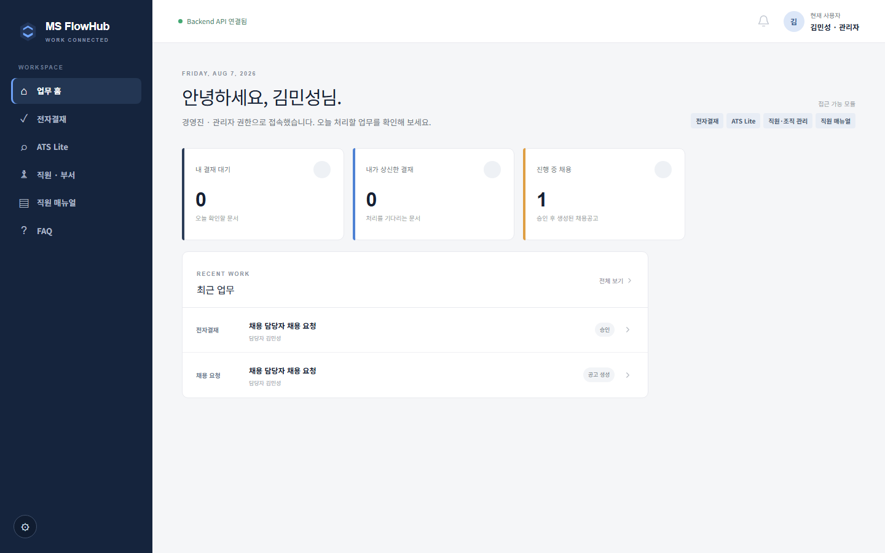

# MS FlowHub

**전자결재를 중심으로 직원·조직, 근태, 채용을 하나로 연결한 사내 업무 포털입니다.**

가상 회사 MS의 직원 46명을 기준 데이터로 만든 취업 포트폴리오 프로젝트이며, Render에 실제로
배포해 운영 중입니다.

| | |
|---|---|
| **화면** | https://ms-flowhub-frontend.onrender.com |
| **API** | https://ms-flowhub.onrender.com ([`/health`](https://ms-flowhub.onrender.com/health)) |

> Render Free 플랜이라 유휴 시 슬립됩니다. 첫 접속은 콜드스타트로 수십 초 걸릴 수 있습니다.



## 무엇을 만들었나

부서마다 도구가 흩어져 있으면 같은 요청 정보를 여러 번 입력하게 되고, 승인 결과와 후속 업무의
연결이 끊깁니다. 채용을 예로 들면 "요청 → 승인 → 공고 → 지원자"가 각각 다른 곳에 남아
추적이 안 됩니다.

MS FlowHub는 **전자결재를 공통 엔진으로 두고** 직원·부서·권한 데이터를 공유합니다.
채용 요청이 결재를 타고 승인되면 공고가 자동으로 생기고, 지원자 전형까지 한 흐름으로 이어집니다.

각 기능을 왜 그렇게 만들었는지는 [docs/PLAN.md](./docs/PLAN.md)에 시간순으로 정리했습니다.

## 기술 구성

| 영역 | 사용 기술 |
|---|---|
| Frontend | Next.js 16 App Router, React 19, TypeScript |
| Backend | FastAPI, SQLAlchemy 2.0(동기 Session), Pydantic |
| Database | Supabase PostgreSQL, Alembic, Psycopg 3 |
| Auth | Supabase Auth, JWT/JWKS |
| AI | Anthropic(문안 초안), OpenAI(포스터 이미지) |
| 검증 | Pytest, Ruff, ESLint, Playwright(수동 실행) |
| 배포 | Render Web Service 2개, GitHub Actions CI |

스타일은 `globals.css`의 시맨틱 클래스와 CSS 변수를 씁니다. Tailwind v4가 설치돼 있지만
유틸리티 클래스는 사용하지 않습니다.

## 구조

```
브라우저 ──▶ Next.js ──▶ FastAPI ──▶ Supabase PostgreSQL
             (rewrite)   Router       요청·응답
                         Service      업무 규칙·트랜잭션
                         Repository   데이터 접근
```

프론트엔드는 업무 테이블에 직접 접근하지 않습니다. Supabase를 직접 부르는 곳은 **로그인 뿐**이고
나머지는 전부 FastAPI를 거칩니다. 권한은 화면 표시와 별개로 **서버가 다시 판정**합니다.

요청 흐름·인증 5단계·계층 구성은 [docs/ARCHITECTURE.md](./docs/ARCHITECTURE.md)에 있습니다.

## 주요 기능

| 영역 | 내용 |
|---|---|
| 인증·권한 | Supabase Auth 로그인, 역할 5종, 자리 비움 자동 로그아웃 |
| 직원·조직·근태 | 부서·파트 2계층, 근무 상태 12종, 공개/비공개 사유 분리, 변경 이력 |
| 전자결재 | 작성·상신·승인·반려·이력, 결재자 파트장급 이상 제한 |
| 채용 | 요청 → 결재 승인 → 공고 자동 생성, 포스터 첨부 |
| ATS Lite | 공고별 지원자 전형 6단계와 이력, 종료 단계 되돌리기 차단 |
| 대시보드 | 개인 지표 3종 + 관리자 분석 6종 (실데이터만) |
| 매뉴얼·FAQ | 이미지 중심 매뉴얼 9건, FAQ 21문항, 역할별 공개 범위 |
| AX 도우미 | 매뉴얼·FAQ에서 근거를 찾아 원문 제시. **LLM 미사용** |
| 생성형 AI | 전자결재·채용공고 문안 초안, 채용 포스터 이미지 2안 |

무엇이 되고 무엇이 안 되는지, 알려진 문제는
[docs/CURRENT_STATE.md](./docs/CURRENT_STATE.md)를 보세요.

## 프로젝트 구조

```text
MS FlowHub/
├─ backend/app/
│  ├─ api/            FastAPI Router와 의존성
│  ├─ services/       업무 규칙과 트랜잭션
│  ├─ repositories/   SQLAlchemy 데이터 접근
│  ├─ models/         ORM 모델
│  ├─ schemas/        Pydantic API 스키마
│  ├─ domain/         순수 규칙·상수·AI Provider (DB·HTTP 비의존)
│  ├─ security/       토큰 검증·ActorContext·역할 상수
│  ├─ core/  db/      설정, 엔진·세션
│  └─ scripts/        Seed와 운영 보조 스크립트
├─ frontend/src/
│  ├─ app/            Next.js App Router 페이지
│  ├─ features/       기능별 UI와 API 호출
│  ├─ components/     공통 UI
│  ├─ lib/            공통 API 클라이언트·Supabase 클라이언트
│  └─ types/          백엔드 스키마 대응 타입
├─ docs/              문서 (docs/README.md에 안내)
├─ AGENTS.md          AI 에이전트 규칙과 Context Map
└─ CLAUDE.md          AGENTS.md와 같은 내용
```

## 실행 방법

```powershell
# 처음 한 번
cd backend
py -3.12 -m venv .venv
.\.venv\Scripts\Activate.ps1
pip install -e ".[dev]"
Copy-Item .env.example .env

cd ..\frontend
npm install
Copy-Item .env.example .env.local
```

`backend/.env`와 `frontend/.env.local`에 Supabase 값을 채운 뒤 프로젝트 루트에서 실행합니다.

```powershell
.\run-backend.cmd     # http://127.0.0.1:8000
.\run-frontend.cmd    # http://localhost:3000
```

### 데이터베이스 준비

```powershell
cd backend
.\.venv\Scripts\alembic.exe upgrade head
.\.venv\Scripts\python.exe -m app.scripts.seed_organization
.\.venv\Scripts\python.exe -m app.scripts.seed_auth_accounts
.\.venv\Scripts\python.exe -m app.scripts.seed_manuals
.\.venv\Scripts\python.exe -m app.scripts.seed_faqs
.\.venv\Scripts\python.exe -m app.scripts.setup_storage_bucket   # 처음 한 번
```

Seed는 반복 실행해도 중복 생성되지 않습니다.

### 환경변수

값은 저장소에 두지 않습니다. 필요한 항목과 설명은
[backend/.env.example](./backend/.env.example)과
[frontend/.env.example](./frontend/.env.example)이 단일 출처입니다.

`SUPABASE_SECRET_KEY`·`DATABASE_URL`·AI 키는 **`NEXT_PUBLIC_*`에 절대 넣지 않습니다.**
브라우저 번들에 그대로 포함됩니다.

### 검증

```powershell
cd backend
.\.venv\Scripts\python.exe -m ruff check . ; .\.venv\Scripts\python.exe -m pytest -q

cd ..\frontend
npm run lint; npm run typecheck; npm run build
```

Backend 회귀 테스트 209건. Playwright E2E(`npm run test:e2e`)는 실제 Supabase에 접속하므로
**수동 실행 전용**이며 CI에서 자동 실행하지 않습니다.

## 문서

전체 안내는 **[docs/README.md](./docs/README.md)** 에 있습니다. 자주 보는 것만 추리면,

- [기능 기획 기록](./docs/PLAN.md) — 무엇을 왜 만들었는지 (시간순)
- [현재 구현 상태](./docs/CURRENT_STATE.md) — 되는 것, 안 되는 것, 알려진 문제
- [시스템 구조](./docs/ARCHITECTURE.md) · [업무 도메인](./docs/DOMAIN.md) ·
  [데이터 모델](./docs/DATA_MODEL.md) · [API](./docs/API_SPEC.md)
- [설계 결정 기록](./docs/DECISIONS.md) — 왜 그 선택을 했는지
- [변경 이력](./UPDATELOG.md) · [문제 해결](./TROUBLESHOOTING.md)

AI 에이전트로 작업한다면 [AGENTS.md](./AGENTS.md)의 Context Map부터 보세요.
