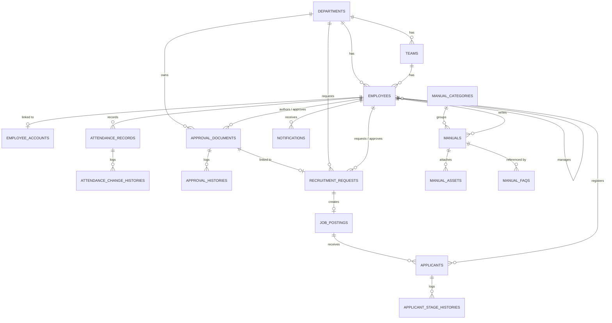

# Data Model

## 1. 문서 개요

이 문서는 MS FlowHub의 **현재 구현된 Supabase PostgreSQL 데이터 모델**을 기준일(2026-08-05) 기준으로 정리한 기록입니다. 실제 운영 DB에 없는 테이블·컬럼·관계는 이 문서에 포함하지 않습니다. 아직 만들어지지 않은 확장 설계는 "14. 향후 확장 계획"에 짧게만 남기고, 과거 초안·미구현 예측 설계는 [`docs/archive/DATA_MODEL_LEGACY.md`](./archive/DATA_MODEL_LEGACY.md)로 이동했습니다. Migration 적용 이력은 이 문서가 아니라 [`UPDATELOG.md`](../UPDATELOG.md)와 `backend/migrations/versions/`를 기준으로 확인합니다.

## 2. 목차

1. [문서 개요](#1-문서-개요)
2. [목차](#2-목차)
3. [현재 데이터베이스 요약](#3-현재-데이터베이스-요약)
4. [기능별 데이터 모델 요약](#4-기능별-데이터-모델-요약)
5. [전체 테이블 목록](#5-전체-테이블-목록)
6. [핵심 관계도](#6-핵심-관계도)
7. [조직·직원·인증](#7-조직직원인증)
8. [근태 관리](#8-근태-관리)
9. [전자결재](#9-전자결재)
10. [채용 요청·채용공고](#10-채용-요청채용공고)
11. [ATS 지원자 관리](#11-ats-지원자-관리)
12. [직원 매뉴얼](#12-직원-매뉴얼)
13. [생성형 AI 기록](#13-생성형-ai-기록)
14. [공통 데이터 규칙](#14-공통-데이터-규칙)
15. [향후 확장 계획](#15-향후-확장-계획)
16. [Migration 정보](#16-migration-정보)

## 3. 현재 데이터베이스 요약

- 운영 DB는 **Supabase PostgreSQL 전용**입니다. SQLite 등 다른 런타임 DB는 사용하지 않습니다.
- 현재 Alembic head는 `20260812_0022_ai_generations.py`이며, 총 22개 migration이 적용되어 있습니다.
- 스키마는 `public` 한 곳에 총 **19개 테이블**(`alembic_version` 포함)로 구성됩니다.
- 프론트엔드는 Supabase 업무 테이블에 직접 접근하지 않고, 항상 FastAPI 백엔드를 거칩니다.
- DB 레벨 `CHECK` 제약이 걸린 상태값은 `approval_documents.status`, `recruitment_requests.status`, `applicants.stage` 3곳뿐이며, 그 외 상태값(근태 상태, 직원 재직 상태, 매뉴얼 상태 등)은 애플리케이션 레이어(Pydantic `Literal`, `app/domain/employee_status.py`)에서 검증합니다.

## 4. 기능별 데이터 모델 요약

| 기능 영역 | 테이블 수 | 테이블 | 상태 |
|---|---|---|---|
| 조직·직원·인증 | 4 | `departments`, `teams`, `employees`, `employee_accounts` | 구현됨 |
| 근태 관리 | 2 | `attendance_records`, `attendance_change_histories` | 구현됨 |
| 전자결재 | 2 | `approval_documents`, `approval_histories` | 구현됨 |
| 채용 요청·채용공고 | 3 | `recruitment_requests`, `job_postings`, `notifications` | 구현됨 |
| ATS 지원자 관리 | 2 | `applicants`, `applicant_stage_histories` | 구현됨 |
| 직원 매뉴얼 | 4 | `manual_categories`, `manuals`, `manual_assets`, `manual_faqs` | 구현됨 |
| AX 직원 도우미 | 1 | `ax_chat_logs` | 구현됨 |
| 생성형 AI | 1 | `ai_generations` | 구현됨 |
| 마이그레이션 관리 | 1 | `alembic_version` | Alembic 내부 관리 |

## 5. 전체 테이블 목록

| 테이블 | 기능 영역 | 설명 | 주요 FK |
|---|---|---|---|
| `departments` | 조직·직원·인증 | 부서 기준 정보 | - |
| `teams` | 조직·직원·인증 | 부서 하위 팀 | `department_id` → `departments.id` |
| `employees` | 조직·직원·인증 | 직원 기준 정보 | `department_id` → `departments.id`, `team_id` → `teams.id`, `manager_id` → `employees.id` |
| `employee_accounts` | 조직·직원·인증 | Supabase Auth 계정과 직원 연결 | `employee_id` → `employees.id` |
| `attendance_records` | 근태 관리 | 직원별 일자 근무 상태 | `employee_id` → `employees.id` |
| `attendance_change_histories` | 근태 관리 | 근태 상태 변경 이력 | `attendance_record_id` → `attendance_records.id`, `changed_by_id` → `employees.id` |
| `approval_documents` | 전자결재 | 전자결재 문서 | `department_id` → `departments.id`, `author_id`/`approver_id` → `employees.id` |
| `approval_histories` | 전자결재 | 결재 처리 이력 | `approval_document_id` → `approval_documents.id`, `actor_id` → `employees.id` |
| `recruitment_requests` | 채용 요청·채용공고 | 채용 요청 | `request_department_id` → `departments.id`, `requester_id`/`approver_id` → `employees.id`, `approval_document_id` → `approval_documents.id` |
| `job_postings` | 채용 요청·채용공고 | 승인된 요청으로 생성된 채용공고 | `recruitment_request_id` → `recruitment_requests.id` |
| `notifications` | 채용 요청·채용공고 | 채용 요청 처리에 따른 인앱 알림 | `recipient_id` → `employees.id` |
| `applicants` | ATS 지원자 관리 | 채용공고별 지원자 | `job_posting_id` → `job_postings.id`, `created_by_id` → `employees.id` |
| `applicant_stage_histories` | ATS 지원자 관리 | 지원자 전형 단계 변경 이력 | `applicant_id` → `applicants.id`, `actor_id` → `employees.id` |
| `manual_categories` | 직원 매뉴얼 | 매뉴얼 카테고리 | - |
| `manuals` | 직원 매뉴얼 | 매뉴얼 본문 | `category_id` → `manual_categories.id`, `created_by`/`updated_by` → `employees.id` |
| `manual_assets` | 직원 매뉴얼 | 매뉴얼 이미지·PDF 자산 | `manual_id` → `manuals.id` |
| `manual_faqs` | 직원 매뉴얼 | 자주 묻는 질문과 답변 | `related_manual_id` → `manuals.id` (선택) |
| `ax_chat_logs` | AX 직원 도우미 | 질문·매칭 결과 로그(익명, 질문자 식별자 없음) | - |
| `ai_generations` | 생성형 AI | AI 초안 생성 1건의 입력·결과·토큰 수 기록 | `created_by_id` → `employees.id` |
| `alembic_version` | 마이그레이션 관리 | Alembic 현재 head 기록 | - |

## 6. 핵심 관계도

## 7. 조직·직원·인증

**기능 요약**: 부서·팀·직원 기준 정보를 관리하고, Supabase Auth 계정을 직원 1명과 1:1로 연결해 로그인 후 역할 기반 권한을 부여합니다.

**사용 테이블**: `departments`, `teams`, `employees`, `employee_accounts`

**테이블별 역할**
- `departments`: 부서 코드·이름·설명·표시 순서.
- `teams`: 부서에 속한 하위 파트(개발팀 산하 `DEV_SW`/`DEV_HW`/`DEV_QA` 등).
- `employees`: 사번·이름·이메일·직급·담당 업무·재직 상태·근무 위치 등 직원 기준 정보와 상급자(`manager_id`) 참조.
- `employee_accounts`: Supabase Auth `auth_user_id`와 `employees.id`를 1:1로 연결하고, 애플리케이션 권한 `role`과 활성 여부를 보관.

**핵심 관계**
- `departments` 1:N `teams`
- `departments` 1:N `employees`, `teams` 1:N `employees`(선택)
- `employees` 1:N `employees`(`manager_id`, 자기참조, 선택)
- `employees` 1:1 `employee_accounts`

**핵심 제약조건**
- `departments.code`, `teams.code`, `teams.name` UNIQUE
- `employees.employee_no`, `employees.email` UNIQUE
- `employees.department_id`는 `RESTRICT`로 부서 삭제를 막고, `team_id`/`manager_id`도 `RESTRICT`
- `employee_accounts.auth_user_id`, `employee_accounts.employee_id` UNIQUE (중복 연결 방지)

**주요 상태값** (DB `CHECK` 아님, 애플리케이션 검증)
- `employees.employment_status`: `ACTIVE`, `ON_LEAVE`, `SCHEDULED`, `RESIGNED`
- `employee_accounts.role`: `SUPER_ADMIN`, `HR_ADMIN`, `TEAM_ADMIN`, `EMPLOYEE`
- `employees.employment_type`: 문자열 컬럼이며 현재 기본값 `REGULAR`만 사용, 별도 enum 제약 없음

**조직 운영 기준**
- 대표이사는 조직 최상단에 두며 화면·조직도에서는 부서와 팀을 `-`로 표시한다. 내부 참조용 `EXEC` 부서는 부서 목록에 노출하지 않는다.
- 개발팀은 SW개발팀, HW개발팀, QA팀으로 구성한다. QA팀의 테스트·품질 업무는 개발팀 내에서 운영한다.
- 마케팅팀·인사팀·기획팀은 각각 1팀과 2팀으로, CS팀은 인원 규모에 맞춰 CS1팀 하나로 운영한다.
- 기존 독립 QA팀은 CS팀으로 전환해 고객 문의·장애 접수·VOC 운영을 담당한다.
- `TEAM_ADMIN`은 `team_id`가 있으면 해당 파트, `team_id`가 없으면 소속 부서 범위의 직원 정보를 조회하고 근태 상태를 관리한다.

**삭제 및 이력 보존 정책**
- 직원 삭제는 물리 삭제가 아니라 `employment_status=INACTIVE` 전환으로 처리(레코드 보존).
- 부서·팀·상급자 참조는 모두 `RESTRICT`라 참조 중인 레코드가 있으면 삭제할 수 없습니다.

## 8. 근태 관리

**기능 요약**: 직원별 하루 단위 근무 상태를 기록하고, 실제로 상태가 바뀐 경우에만 변경 이력을 남깁니다.

**사용 테이블**: `attendance_records`, `attendance_change_histories`

**테이블별 역할**
- `attendance_records`: 직원 1명의 특정 날짜 근무 상태, 출퇴근 시각, 공개 사유(`reason_summary`)와 비공개 상세(`private_note`).
- `attendance_change_histories`: 근무 상태가 실제로 변경된 시점의 변경 전/후 상태·사유·변경자·변경 시각.

**핵심 관계**
- `employees` 1:N `attendance_records`
- `attendance_records` 1:N `attendance_change_histories`

**핵심 제약조건**
- `attendance_records`는 `(employee_id, work_date)` UNIQUE로 직원당 하루 1건만 허용(Seed 재실행 시 중복 방지).
- `attendance_records.employee_id`는 `CASCADE` 삭제, `attendance_change_histories.changed_by_id`는 `RESTRICT`.

**주요 상태값** (`app/domain/employee_status.py`, 애플리케이션 검증)
- `work_status`: `WORKING`, `REMOTE_WORK`, `OUT_OF_OFFICE`, `BUSINESS_TRIP`, `ANNUAL_LEAVE`, `MORNING_HALF`, `AFTERNOON_HALF`, `SICK_LEAVE`, `TRAINING`, `OTHER`, `OFF_WORK`, `ABSENT`
- `SICK_LEAVE`, `ABSENT`는 사유 입력이 필수입니다.

**삭제 및 이력 보존 정책**
- 근태 변경 이력은 append-only 감사 기록이며 수정·삭제 API가 없습니다.
- 비공개 사유(`private_note`)는 `SUPER_ADMIN`, `HR_ADMIN`, `ADMIN`, `HR_MANAGER`에게만 조회되며, 일반 직원·팀 관리자 응답에서는 제외됩니다.

## 9. 전자결재

**기능 요약**: 일반 품의 문서와 채용 요청에 연결되는 결재 문서를 작성·상신·승인·반려하고, 모든 처리 행위를 이력으로 남깁니다.

**사용 테이블**: `approval_documents`, `approval_histories`

**테이블별 역할**
- `approval_documents`: 문서 종류·제목·본문·작성자·결재자·상태·처리 시각과 관련 업무(`related_type`/`related_id`, 예: 채용 요청) 참조.
- `approval_histories`: 생성·상신·승인·반려 등 처리 행위와 상태 전이(`from_status` → `to_status`) 기록.

**핵심 관계**
- `departments` 1:N `approval_documents`
- `employees` 1:N `approval_documents`(작성자, 결재자 각각)
- `approval_documents` 1:N `approval_histories`

**핵심 제약조건**
- `approval_documents.status` DB `CHECK`: `DRAFT`, `PENDING`, `APPROVED`, `REJECTED`, `CANCELLED`
- `department_id`, `author_id`, `approver_id`는 모두 `RESTRICT`

**주요 상태값**
- `document_type`: `GENERAL`, `RECRUITMENT_REQUEST`가 실제로 생성되며, `EXPENSE`, `QUOTATION_DISCOUNT`는 타입에는 정의되어 있으나 현재 생성 로직에서 사용되지 않습니다.
- `approval_histories.action`: `CREATED`, `SUBMITTED`, `UPDATED`, `APPROVED`, `REJECTED`

**삭제 및 이력 보존 정책**
- 관리자(`SUPER_ADMIN`, `ADMIN`)만 상태와 무관하게 문서를 물리 삭제할 수 있고, 그 외 역할은 삭제할 수 없습니다.
- `approval_histories`는 수정·삭제하지 않는 감사 원칙을 따릅니다.

## 10. 채용 요청·채용공고

**기능 요약**: 부서의 채용 요청을 작성해 전자결재로 승인받으면 채용공고가 생성되고, 요청 처리 결과에 따라 관련자에게 인앱 알림을 남깁니다.

**사용 테이블**: `recruitment_requests`, `job_postings`, `notifications`

**테이블별 역할**
- `recruitment_requests`: 요청 부서·요청자·결재자, 직무·인원·고용 형태·경력 코드/최소 연수·학력·근무지·급여·모집 마감일·지원 방법·채용 사유, 채용 포스터 메타데이터(`poster_original_name`, `poster_stored_name`, `poster_content_type`, `poster_size`), 연결된 결재 문서. `experience_years_min`, `education_level`, `work_location`, `salary`, `application_deadline`, `apply_method`는 기존 데이터 호환을 위해 nullable입니다.
- `job_postings`: 승인된 요청 1건당 생성되는 채용공고 초안(제목·본문).
- `notifications`: 요청 상신·승인·반려에 따라 생성·삭제되는 인앱 알림 레코드.

**핵심 관계**
- `departments` 1:N `recruitment_requests`
- `employees` 1:N `recruitment_requests`(요청자, 결재자 각각)
- `recruitment_requests` 1:0..1 `approval_documents`
- `recruitment_requests` 1:0..1 `job_postings`
- `employees` 1:N `notifications`

**핵심 제약조건**
- `recruitment_requests.status` DB `CHECK`: `DRAFT`, `PENDING_APPROVAL`, `APPROVED`, `REJECTED`, `POSTING_CREATED`
- `recruitment_requests.approval_document_id` UNIQUE
- `job_postings.recruitment_request_id` UNIQUE (요청당 채용공고 1건만 허용)
- 신규 요청의 `experience_level`은 `NEW`, `EXPERIENCED`, `ANY` 코드이며, `EXPERIENCED`일 때만 `experience_years_min`을 사용합니다. 기존 자유 입력 값은 표시 호환을 위해 유지합니다.

**주요 상태값**
- `recruitment_requests.status`는 위 5개 값을 사용하며 결재 문서 상태와는 별도로 관리됩니다.
- `job_postings.status`는 현재 생성 시 `DRAFT`로 고정되며, 별도 상태 전이 API는 아직 없습니다.

**삭제 및 이력 보존 정책**
- 채용 요청 삭제는 관리자(`SUPER_ADMIN`, `ADMIN`) 전용이며, 연결된 채용공고·알림을 함께 정리한 뒤 요청을 삭제합니다.
- 채용 포스터 원본 파일은 Supabase Storage 비공개 버킷(`recruitment-posters`)에 있으며, 요청 삭제·포스터 교체 시 이전 파일도 함께 제거합니다. 다운로드는 항상 백엔드 API를 거쳐 권한을 검증한 뒤 응답합니다.

## 11. ATS 지원자 관리

**기능 요약**: 외부 공개 지원 페이지 없이 HR이 채용공고별 지원자를 수동 등록하고, 전형 단계 변경과 이력을 관리합니다.

**사용 테이블**: `applicants`, `applicant_stage_histories`

**테이블별 역할**
- `applicants`: 지원자 이름·이메일·전화번호·경력 요약·현재 전형 단계와 등록자(`created_by_id`).
- `applicant_stage_histories`: 등록 시점(`from_stage=NULL` → `to_stage=APPLIED`)을 포함한 모든 전형 단계 변경 기록과 처리자.

**핵심 관계**
- `job_postings` 1:N `applicants`
- `applicants` 1:N `applicant_stage_histories`
- `employees` 1:N `applicants`(등록자), `employees` 1:N `applicant_stage_histories`(처리자)

**핵심 제약조건**
- `applicants.stage` DB `CHECK`: `APPLIED`, `SCREENING`, `INTERVIEW`, `OFFERED`, `HIRED`, `REJECTED`
- `(job_posting_id, email)` UNIQUE로 같은 공고 내 이메일 중복 등록을 차단
- `applicants.job_posting_id`는 `CASCADE`, `created_by_id`는 `RESTRICT`
- `applicant_stage_histories.applicant_id`는 `CASCADE`, `actor_id`는 `RESTRICT`

**주요 상태값**
- 화면 표시명은 `APPLIED`="지원 접수", `SCREENING`="서류 검토", `INTERVIEW`="1차 면접", `OFFERED`="2차 면접", `HIRED`="채용 확정", `REJECTED`="불합격"이며, DB에 저장되는 값 자체는 변경되지 않았습니다.
- `HIRED`, `REJECTED`는 종료 단계로 되돌릴 수 없고, `REJECTED` 처리에는 메모가 필수입니다.

**삭제 및 이력 보존 정책**
- 채용공고 삭제 시 `applicants`가 `CASCADE`로 함께 삭제되고, 지원자 삭제 시 `applicant_stage_histories`도 `CASCADE`로 함께 삭제됩니다.
- `SUPER_ADMIN`, `HR_ADMIN`만 등록·수정·삭제·단계 변경이 가능하고, `TEAM_ADMIN`은 본인 부서 공고만 조회하며, `EMPLOYEE`는 지원자 API에 접근할 수 없습니다.

## 12. 직원 매뉴얼

**기능 요약**: 로그인 업무 절차부터 채용 요청까지 카테고리별 매뉴얼 본문과 이미지·PDF 자산을 제공합니다.

**사용 테이블**: `manual_categories`, `manuals`, `manual_assets`

**테이블별 역할**
- `manual_categories`: 카테고리 이름·설명·표시 순서.
- `manuals`: 제목·요약·본문·대상 역할(`target_roles`)·공개 상태·중요 고정 여부와 작성자/수정자.
- `manual_assets`: 매뉴얼에 연결된 이미지 또는 PDF의 URL과 표시 순서. 목록 화면의 카드 대표 이미지가 여기서 나오며, 현재는 매뉴얼별로 해당 기능의 실제 화면을 캡처한 `/manuals/screens/*.png`를 가리킵니다.
- `manual_faqs`: 자주 묻는 질문과 답변, 카테고리, 표시 순서, 공개 여부. 특정 매뉴얼과 선택적으로 연결할 수 있습니다.

**핵심 관계**
- `manual_categories` 1:N `manuals`
- `manuals` 1:N `manual_assets`
- `manuals` 1:0..N `manual_faqs` (`related_manual_id`, 선택적 연결)
- `employees` 1:N `manuals`(작성자, 수정자 각각, 선택)

**핵심 제약조건**
- `manual_categories.name` UNIQUE, `manuals.slug` UNIQUE
- `manuals.category_id`는 `RESTRICT`(카테고리에 매뉴얼이 남아 있으면 삭제 불가)
- `manual_assets.manual_id`는 `CASCADE`
- `manuals.created_by`/`updated_by`는 `SET NULL`
- `manual_faqs.related_manual_id`는 `SET NULL`(매뉴얼이 삭제돼도 FAQ 자체는 남습니다)

**주요 상태값**
- `manuals.status`: `DRAFT`, `PUBLISHED`
- `manual_assets.asset_type`: `IMAGE`, `PDF`
- `manuals.target_roles`에 포함 가능한 값: `SUPER_ADMIN`, `HR_ADMIN`, `TEAM_ADMIN`, `EMPLOYEE`
- `manual_faqs.is_published`: 공개 FAQ만 `GET /api/v1/faqs` 응답에 포함됩니다.

**UI 참고**: 목록 화면은 이미지 중심 카드로 단순화되어 있고 매뉴얼 상세 페이지는 제공하지 않습니다. `manuals.content`, `slug`, `target_roles`는 화면에 노출되지 않지만 관리자 편집과 향후 RAG 검색을 위해 그대로 보존합니다.

**Seed 구성**: 직원 이용 가이드 PDF의 기능 구조에 맞춰 6개 카테고리와 9개 핵심 매뉴얼로 정리되어 있습니다. 통합 전 매뉴얼의 본문은 핵심만 추려 남은 매뉴얼의 `content`에 합쳤으므로 RAG가 검색할 문장은 유지됩니다. `seed_manuals`는 `REMOVED_MANUAL_SLUGS`와 `REMOVED_CATEGORY_IDS`로 통합된 과거 데이터를 정리하며, 카테고리는 소속 매뉴얼이 없을 때만 삭제합니다.

**삭제 및 이력 보존 정책**
- 매뉴얼 삭제 시 연결된 `manual_assets`가 함께 삭제됩니다(`cascade="all, delete-orphan"`).
- 초안(`DRAFT`)은 `SUPER_ADMIN`, `HR_ADMIN`에게만 노출되고, 공개 매뉴얼(`PUBLISHED`)은 모든 인증된 직원이 조회할 수 있습니다.

## 13. 생성형 AI 기록

### `ai_generations`

AI 초안 생성 1건을 남깁니다. **업무 테이블이 아닙니다.** 이 테이블에 행이 생겨도 전자결재·채용 상태는 변하지 않습니다.

| 컬럼 | 타입 | 설명 |
|---|---|---|
| `id` | String(50) PK | `ai-gen-{uuid4hex}` |
| `feature_type` | String(40) | `APPROVAL_DRAFT` / `JOB_POSTING_DRAFT` |
| `related_type`, `related_id` | String nullable | 업무 대상 연결(초안 단계에서는 비어 있을 수 있음) |
| `source_input` | JSON | 호출 시점의 AI Context 스냅샷 |
| `generated_output` | JSON nullable | **AI 최초 결과.** 재실행·수정 시 덮어쓰지 않음 |
| `final_output` | JSON nullable | 사용자가 수정해 실제로 적용한 최종본 |
| `provider`, `model_name` | String | `mock` 또는 실제 Provider와 모델명 |
| `success`, `error_message` | Boolean, Text | 실패도 기록. 스키마 위반은 실패로 처리 |
| `input_tokens`, `output_tokens` | Integer nullable | 비용 추적용 |
| `created_by_id` | FK `employees.id` | |
| `created_at` | timestamptz | |

**인덱스**
- `ix_ai_generations_feature_created` (`feature_type`, `created_at`)
- `ix_ai_generations_related` (`related_type`, `related_id`)
- `ix_ai_generations_creator_created` (`created_by_id`, `created_at`) — 일일 호출 제한 조회용

**설계 의도**
- `generated_output`과 `final_output`을 나눈 이유는 "AI가 무엇을 냈고 사람이 무엇을 고쳤는지"를 잃지 않기 위해서입니다. 재실행은 기존 행을 덮어쓰지 않고 새 행을 만듭니다.
- 토큰 수를 저장해 Console을 열지 않고도 쿼리 하나로 실지출을 계산합니다. 이상 급증을 조기에 발견하는 수단이기도 합니다.
- `created_by_id`와 `created_at`으로 최근 24시간 호출 수를 세어 일일 한도(사용자당·전역)를 강제합니다. 별도 테이블이 필요 없습니다.
- 개인정보는 `source_input`에 담지 않습니다. Context Builder가 이름·직급·부서·팀만 통과시키고 이메일·사번·근태 사유는 제외합니다.

상세 설계는 [`AI_AUTOMATION_PLAN.md`](AI_AUTOMATION_PLAN.md)를 참고합니다.

## 14. 공통 데이터 규칙

- 모든 시각 컬럼은 PostgreSQL timezone-aware `timestamptz`를 사용하며 UTC로 저장하고 화면에서 지역 시간으로 표시합니다.
- 대부분의 PK는 UUID 문자열이며, 업무 테이블은 `created_at`, `updated_at`을 기본으로 둡니다.
- Soft delete를 일괄 적용하지 않습니다. 감사가 중요한 결재·근태 변경은 상태 변경/이력 테이블로 보존하고, 직원처럼 참조가 많은 기준 데이터는 비활성 플래그(`employment_status=INACTIVE`, `is_active` 등)로 처리합니다.
- 상태값은 소수(`approval_documents.status`, `recruitment_requests.status`, `applicants.stage`)만 DB `CHECK` 제약으로 강제하고, 나머지는 Pydantic `Literal`과 `app/domain/` 정책 모듈에서 검증합니다.
- 실제 운영 DB는 Supabase PostgreSQL 하나이며, 별도 fallback DB는 사용하지 않습니다.

## 15. 향후 확장 계획

- **이력서 파일 첨부, 외부 공개 지원 페이지, 이메일 발송, 면접 일정 관리**: ATS 지원자 관리 MVP 범위에서 의도적으로 제외했습니다.
- **AI 자동 평가/생성 이력**: 채용·매뉴얼 등에서 AI 결과를 저장하는 공통 테이블은 아직 만들지 않았습니다. 도입 시 업무별로 나누기보다 공통 테이블 하나로 시작하는 방향을 검토합니다.
- **다일 휴가 기간 관리**: 현재 `attendance_records`는 하루 단위 상태만 관리합니다. 여러 날에 걸친 휴가를 별도 기간 단위로 관리하는 확장은 일별 근태 기록과 독립적으로 설계해, 기간이 나중에 정정되어도 과거 일별 기록이 보존되도록 하는 것을 전제로 검토합니다.
- **알림 조회·읽음 처리**: `notifications` 테이블과 데이터는 이미 쌓이고 있지만, 조회·읽음 처리 API와 화면은 아직 구현하지 않았습니다.

과거에 검토했던 더 상세한 초안(테이블 컬럼 후보, 관계 설계 근거 등)은 [`docs/archive/DATA_MODEL_LEGACY.md`](./archive/DATA_MODEL_LEGACY.md)에 보존되어 있습니다.

## 16. Migration 정보

- 현재 Alembic head: `20260812_0022_ai_generations.py`
- Migration 파일 위치: `backend/migrations/versions/`
- Migration별 작업 배경과 진행 기록은 이 문서가 아니라 [`UPDATELOG.md`](../UPDATELOG.md)를 기준으로 확인합니다.
- 적용 명령: `cd backend && .\.venv\Scripts\alembic.exe upgrade head` (자세한 절차는 [`README.md`](../README.md#데이터베이스와-seed) 참고)
