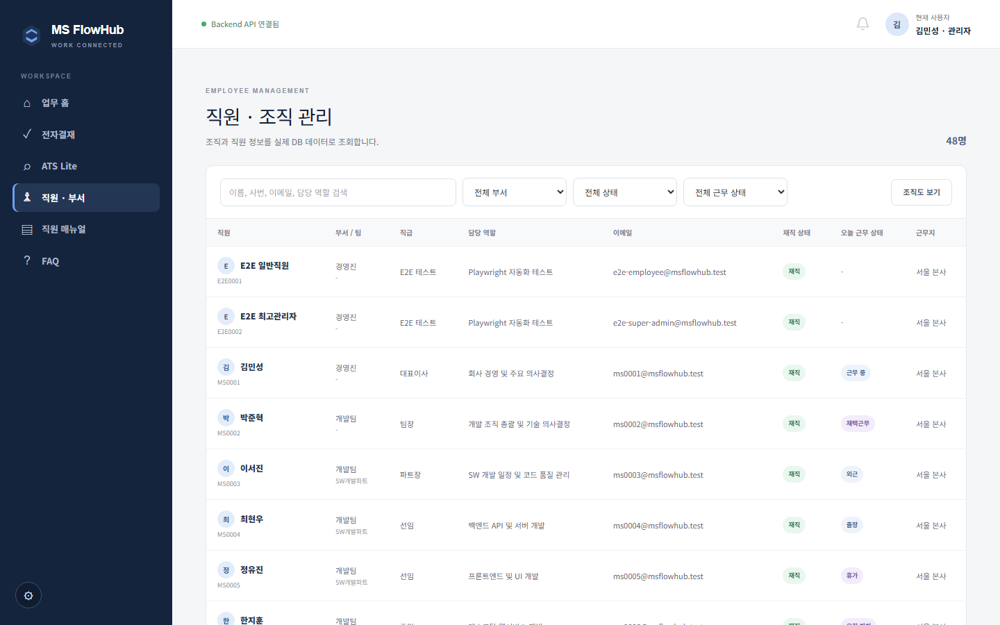
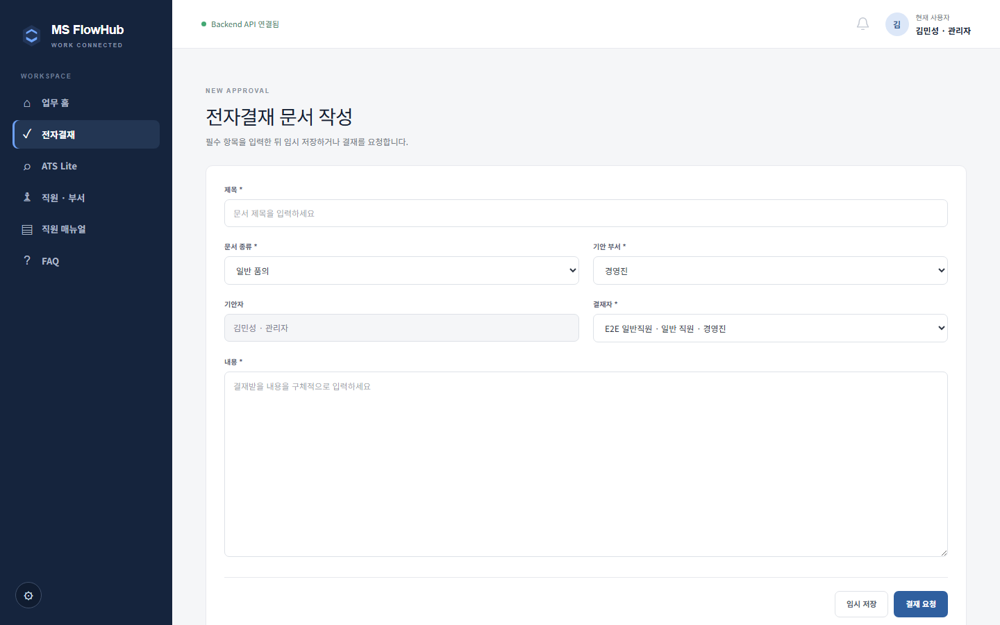
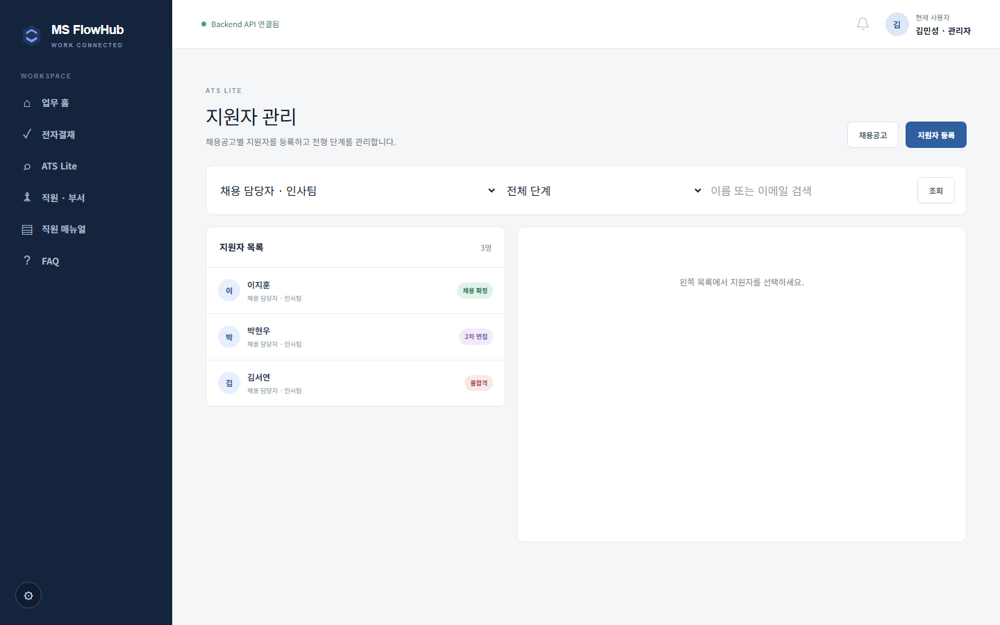
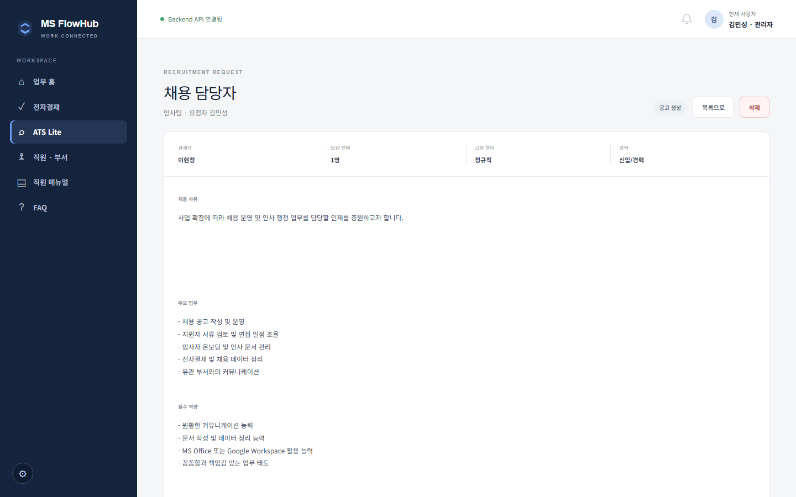
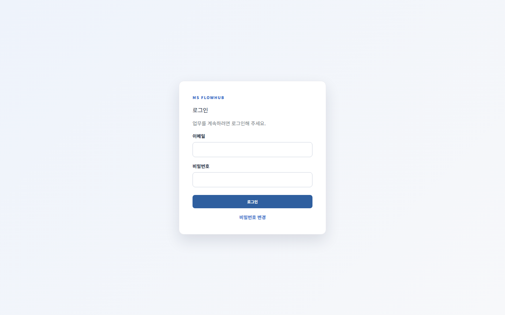
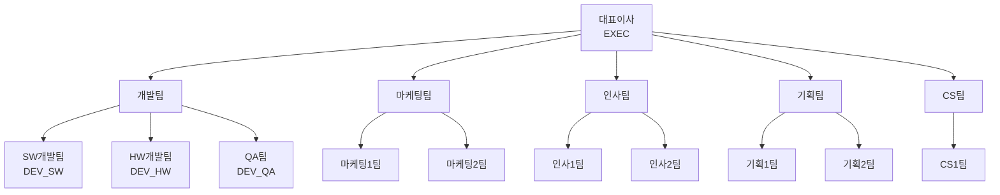
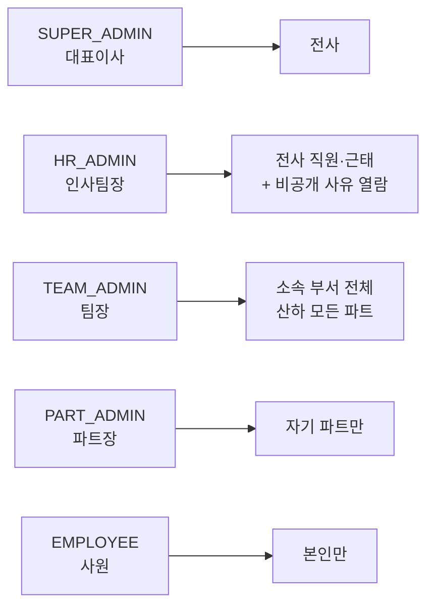

# 기능 기획 기록

**무엇을 왜 만들었고 어떤 판단을 했는지**를 시간순으로 적은 문서입니다.

각 기능이 **지금 어떻게 동작하는지**는 여기 적지 않습니다. 코드가 바뀌면 문서가 거짓말을 하기
때문입니다. 동작은 아래 문서가 단일 출처입니다.

| 알고 싶은 것 | 볼 문서 |
|---|---|
| 지금 무엇이 되고 안 되는지 | [`CURRENT_STATE.md`](CURRENT_STATE.md) |
| 업무 규칙·권한·상태 전이 | [`DOMAIN.md`](DOMAIN.md) |
| 테이블·컬럼·관계 | [`DATA_MODEL.md`](DATA_MODEL.md) |
| 엔드포인트 | [`API_SPEC.md`](API_SPEC.md) |
| 구조·인증 흐름·배포 | [`ARCHITECTURE.md`](ARCHITECTURE.md) |
| 설계 판단의 근거(ADR) | [`DECISIONS.md`](DECISIONS.md) |
| 날짜별 변경 이력 | [`../UPDATELOG.md`](../UPDATELOG.md) |

초기 기획 원문은 [`archive/`](archive/)에 보존돼 있습니다. 처음 계획과 최종 결과를 비교하려면
그쪽을 보세요.

## 목차

1. [프로젝트 배경과 범위](#1-프로젝트-배경과-범위--2026-07-30)
2. [조직·직원·근태 기반](#2-조직직원근태-기반--2026-08-01--08-03)
3. [전자결재 엔진](#3-전자결재-엔진--2026-08-04--08-06)
4. [Render 배포](#4-render-배포--2026-08-05--08-06)
5. [직원 매뉴얼과 FAQ](#5-직원-매뉴얼과-faq--2026-08-07)
6. [ATS Lite 지원자 관리](#6-ats-lite-지원자-관리--2026-08-07--08-09)
7. [관리자 업무 현황 대시보드](#7-관리자-업무-현황-대시보드--2026-08-08)
8. [CI 구성과 E2E 전략](#8-ci-구성과-e2e-전략--2026-08-08)
9. [AX 직원 도우미](#9-ax-직원-도우미--2026-08-09--08-10)
10. [생성형 AI 초안 생성](#10-생성형-ai-초안-생성--2026-08-12)
11. [채용 정보 구체화와 AI 포스터](#11-채용-정보-구체화와-ai-포스터--2026-08-13)
12. [세션 자동 로그아웃](#12-세션-자동-로그아웃--2026-08-13)
13. [Feature Freeze와 배포 게이트](#13-feature-freeze와-배포-게이트--2026-08-13--08-14)
14. [조직 계층과 역할 기반 권한 설계](#14-조직-계층과-역할-기반-권한-설계--2026-08-14)
15. [데드코드·문서 정리](#15-데드코드문서-정리--2026-08-14)

---

## 1. 프로젝트 배경과 범위 — 2026-07-30

### 왜 만들었나

부서별로 도구가 흩어져 있으면 같은 요청 정보를 여러 번 입력하게 되고, 승인 결과와 후속 업무의
연결이 끊깁니다. 채용을 예로 들면 "요청 → 승인 → 공고 → 지원자"가 각각 다른 곳에 남아
추적이 안 됩니다.

### 무엇을 만들기로 했나

전자결재를 **공통 엔진**으로 두고 직원·조직 데이터를 공유하는 사내 업무 포털.
가상 회사 MS의 직원 46명을 기준 데이터로 삼았습니다.

### 어떤 판단을 했나

- **전자결재를 중심에 뒀습니다.** 채용 요청과 할인 승인이 같은 승인 규칙을 공유하므로,
  결재를 엔진으로 두고 다른 모듈을 연결하면 규칙을 재사용할 수 있습니다.
- **범위를 명시적으로 잘랐습니다.** 실제 이메일 발송, PDF 분석·OCR, RAG·벡터 DB, 다단계 결재,
  WebSocket 실시간 알림, Docker, 모바일 앱, 자동 채용 결정은 제외했습니다.
  포트폴리오에서 넓게 벌리는 것보다 하나를 끝까지 연결하는 편이 낫다고 봤습니다.

### 결과

전자결재 → 채용 요청 → 공고 → 지원자 → 대시보드 집계까지 한 줄로 이어지는 흐름을 완성했습니다.
원문 → [`archive/PROJECT_SPEC.md`](archive/PROJECT_SPEC.md)

---

## 2. 조직·직원·근태 기반 — 2026-08-01 ~ 08-03



### 왜 만들었나

모든 모듈이 "누가 누구의 상급자인지", "어느 부서 소속인지"를 필요로 합니다. 결재선도 권한도
여기서 나오므로 기준 데이터를 먼저 세워야 했습니다.

### 무엇을 만들었나

부서 6개와 그 산하 파트 10개, 직원 46명 기준 데이터. 이름·사번·이메일 검색과
부서·재직 상태·근무 상태 필터. 날짜별 근무 상태 등록과 변경 이력.

### 어떤 판단을 했나

- **조직을 2계층으로 뒀습니다.** `departments`(부서) → `teams`(부서 산하 파트).
  개발팀 산하 SW·HW·QA처럼 부서 안에서 다시 나뉘는 구조가 실제 조직과 맞습니다.
- **근태 사유를 공개와 비공개로 분리했습니다.** 병가 사유를 팀원 전체가 보면 안 되지만
  인사 담당자는 봐야 합니다. `reason_summary`(공개)와 `private_note`(비공개)를 나누고,
  권한 없는 조회자에게는 응답 단계에서 비공개 필드를 제거합니다.
- **직원 삭제를 물리 삭제로 하지 않았습니다.** 결재 이력·근태 기록이 직원을 참조하므로
  `employment_status` 전환으로 처리하고 레코드는 보존합니다.
- **이력은 실제로 값이 바뀐 경우에만 남깁니다.** 저장 버튼을 눌렀다는 이유만으로 이력이 쌓이면
  나중에 아무도 안 읽습니다.

### 결과

이후 모든 모듈이 이 데이터를 공유합니다.
상세 → [`DOMAIN.md`](DOMAIN.md#직원조직과-근태) · [`DATA_MODEL.md`](DATA_MODEL.md)

---

## 3. 전자결재 엔진 — 2026-08-04 ~ 08-06



### 왜 만들었나

프로젝트의 중심 기능이자 다른 모듈이 올라탈 엔진입니다.

### 무엇을 만들었나

문서 작성·수정·상신·승인·반려·삭제와 처리 이력. 상태는 `DRAFT` → `PENDING` →
`APPROVED`/`REJECTED`.

### 어떤 판단을 했나

- **작성자를 요청 본문에서 받지 않습니다.** 인증된 `ActorContext`에서 가져옵니다.
  클라이언트가 보낸 작성자 값을 믿으면 남의 이름으로 문서를 만들 수 있습니다.
- **본인 문서 자가승인을 막았습니다.** 단, 관리자가 채용 요청 문서를 처리하는 경우만 예외로
  뒀습니다. 승인 흐름이 막히는 것을 피하기 위한 실무적 타협입니다.
- **결재자 자격을 직책으로 제한했습니다.** 처음엔 "팀장급 이상"이었고,
  2026-08-14에 **파트장급 이상**으로 넓혔습니다 — 14절 참고.
- **상태 변경 규칙을 Service에 뒀습니다.** Router에 흩어지면 같은 규칙이 여러 곳에 복제됩니다.

### 결과

채용 요청이 이 엔진을 그대로 타고 승인되면 공고가 자동 생성됩니다.
상태 전이와 권한 규칙 → [`DOMAIN.md`](DOMAIN.md#전자결재)

---

## 4. Render 배포 — 2026-08-05 ~ 08-06

### 왜 만들었나

"로컬에서만 도는 프로젝트"와 "실제로 접속되는 서비스"는 설득력이 다릅니다.

### 어떤 판단을 했나

- **Vercel 대신 Render를 골랐습니다.** 프론트만 보면 Vercel이 낫지만, 백엔드가 요청마다 동기
  SQLAlchemy 세션으로 Supabase에 붙는 상시 서버 구조라 서버리스 함수와 맞지 않습니다
  (커넥션 풀 고갈, 실행시간 제한). Render는 둘 다 상시 서버로 올릴 수 있어 코드를 거의 고치지
  않고 배포했습니다.
- **파일 저장을 Supabase Storage로 먼저 옮겼습니다.** Render 파일시스템은 재배포 시 초기화되므로,
  이 전환이 없었다면 배포 후 첨부 파일이 사라졌을 것입니다.
- **무료 플랜을 감수했습니다.** 유휴 시 슬립되어 첫 요청이 수십 초 걸리지만,
  포트폴리오 용도에는 상시 가동 비용이 정당화되지 않습니다.

### 결과

Backend `MS-FlowHub` · Frontend `ms-flowhub-frontend` 두 서비스로 운영 중입니다.
설정값과 주의사항 → [`DEPLOYMENT_PLAN.md`](DEPLOYMENT_PLAN.md)

---

## 5. 직원 매뉴얼과 FAQ — 2026-08-07

### 왜 만들었나

기능이 늘면서 "이 화면에서 무엇을 할 수 있는지" 안내가 필요해졌습니다. 동시에 뒤에 만들
AX 도우미가 답의 근거로 삼을 **지식 베이스**가 필요했습니다.

### 무엇을 만들었나

카테고리 6개와 핵심 매뉴얼 9건, FAQ 21문항. 실제 앱 화면을 캡처해 카드 대표 이미지로 씁니다.

### 어떤 판단을 했나

- **역할별 공개 범위(`target_roles`)를 뒀습니다.** 관리자용 매뉴얼을 일반 직원이 보면
  권한 밖 기능을 시도하게 됩니다.
- **이미지 중심으로 갔습니다.** 글로만 된 매뉴얼은 안 읽힙니다. 이 스크린샷들은 지금
  이 문서의 기능 예시로도 재사용되고 있습니다.

### 결과

AX 도우미가 이 데이터를 근거로 답합니다. 매뉴얼이 없으면 도우미도 답할 수 없습니다.

---

## 6. ATS Lite 지원자 관리 — 2026-08-07 ~ 08-09



### 왜 만들었나

채용 요청이 승인돼 공고가 생겨도 **지원자를 추적할 곳이 없었습니다.** 흐름이 공고에서 끊겼습니다.

### 무엇을 만들었나

공고별 지원자 등록·수정·삭제, 전형 6단계(`APPLIED` → `SCREENING` → `INTERVIEW` → `OFFERED` →
`HIRED`/`REJECTED`) 변경과 이력.

### 어떤 판단을 했나

- **종료 단계를 되돌릴 수 없게 막았습니다.** `HIRED`와 `REJECTED`는 최종입니다. 실수 복구보다
  기록의 신뢰가 중요하다고 봤습니다.
- **불합격 시 메모를 필수로 했습니다.** 이유 없는 불합격 기록은 나중에 아무 도움이 안 됩니다.
- **이력서 파일 업로드를 범위에서 뺐습니다.** Storage 정책과 개인정보 취급 기준이 먼저
  필요했습니다.
- **같은 공고에 같은 이메일 중복 등록을 서버에서 막았습니다.**

### 결과

지원자 등록 → 단계 변경 → 대시보드 집계까지 연결됐습니다.
원문 → [`archive/ATS_APPLICANT_MVP_PLAN.md`](archive/ATS_APPLICANT_MVP_PLAN.md)

---

## 7. 관리자 업무 현황 대시보드 — 2026-08-08


### 왜 만들었나

모듈이 늘면서 "지금 내가 처리할 게 뭔지"를 한눈에 볼 곳이 필요했습니다.

### 무엇을 만들었나

로그인한 직원 기준 지표 3종(내 결재 대기·내가 상신한 결재·진행 중 채용)과
관리자 전용 분석 6종(결재 상태 분포, 평균 처리시간, 지원자 전형단계 분포, 채용 요청 수,
오늘 근태 분포, 근태 미등록 수).

### 어떤 판단을 했나

- **분석 지표는 관리자에게만 보여줍니다.** 전사 결재 처리시간을 사원이 볼 이유가 없습니다.
- **가짜 데이터를 넣지 않기로 했습니다.** 실데이터가 적어 지표가 비어 보이지만, 운영 DB에
  시연용 레코드를 섞으면 실제 업무 기록과 구분이 안 됩니다. 근거 → [`DECISIONS.md`](DECISIONS.md)
- **E2E 테스트 계정을 집계에서 제외했습니다.** 테스트 계정이 직원 수에 섞이면 지표가 틀립니다.

### 결과

값이 있는 지표 카드를 누르면 해당 업무 화면으로 이동합니다.

---

## 8. CI 구성과 E2E 전략 — 2026-08-08

### 왜 만들었나

기능이 늘수록 손으로 전부 확인하기 어려워졌습니다. 회귀를 자동으로 잡을 장치가 필요했습니다.

### 무엇을 만들었나

GitHub Actions CI 두 잡 — Backend(Ruff check·format·pytest)와
Frontend(lint·typecheck·production build). master push와 PR마다 실행됩니다.

### 어떤 판단을 했나

- **E2E를 CI에서 빼고 수동 실행 전용으로 분리했습니다.** Playwright 시나리오가 실제 Supabase에
  접속하고 서비스 롤 키를 씁니다. push마다 자동 실행하면 운영 데이터에 손대는 작업이
  무인으로 돌아가게 됩니다. `workflow_dispatch`로 두고 필요할 때만 실행합니다.
- **CI에 Secret을 넣지 않았습니다.** Backend 테스트는 인메모리 SQLite와 가짜 Storage를 쓰고,
  Frontend 빌드는 Supabase 환경변수 없이 통과합니다. Secret이 없으면 유출 경로도 없습니다.
- **E2E 전용 계정을 접두어로 격리했습니다.** `E2E`로 시작하는 사번은 일반 사용자의 목록과
  대시보드 집계에서 제외되고, 테스트 종료 시 삭제됩니다.

### 결과

이 CI가 2026-08-13의 배포 게이트로 이어집니다 — 13절 참고.
원문 → [`archive/CI_E2E_PLAN.md`](archive/CI_E2E_PLAN.md)

---

## 9. AX 직원 도우미 — 2026-08-09 ~ 08-10

### 왜 만들었나

매뉴얼을 만들어도 필요한 순간에 찾아 들어가지 않습니다. 화면 안에서 바로 물어볼 창구가
필요했습니다.

### 무엇을 만들었나

우측 하단 플로팅 도우미. 등록된 매뉴얼·FAQ에서 질문에 맞는 문서를 찾아 **원문을 보여줍니다.**
응답은 5종 — 확정 답변 / 후보 제시 / 근거 없음 / 정책 고정 응답 / 범위 밖 안내.

### 어떤 판단을 했나

**LLM을 호출하지 않기로 한 것이 이 기능의 핵심 판단입니다.**

- 사내 규정을 묻는 도구가 그럴듯한 문장을 지어내면 **틀린 답이 규정처럼 읽힙니다.**
  문서에 없으면 "찾지 못했다"고 답하는 편이 안전합니다.
- 매칭은 글자 1+2gram과 IDF 가중 포함률, 카테고리 부스트로 계산합니다(`domain/ax_search.py`).
  RAG나 벡터 DB 없이 매뉴얼 수십 건 규모에서 충분히 동작합니다.
- **역할별 공개 범위를 검색 후보 단계에서 걸러냅니다.** 답을 만든 뒤 가리는 게 아니라
  애초에 후보에 넣지 않습니다.
- **질문 로그를 익명으로 남깁니다.** 질문자 식별자 없이 상위 후보 3개를 함께 기록해
  매칭 실패 원인만 분석합니다.

### 결과

문서에 없는 것은 답하지 않는 도우미가 됐습니다. 이 판단은 뒤이어 만든 생성형 AI 기능에도
그대로 이어집니다.
원문 → [`archive/AX_FAQ_CHATBOT_PLAN.md`](archive/AX_FAQ_CHATBOT_PLAN.md)

---

## 10. 생성형 AI 초안 생성 — 2026-08-12

### 왜 만들었나

품의 문서 문안 작성에 시간이 들고 사람마다 형식이 제각각이었습니다. 반복되는 문장 작업을
줄이되 **업무 판단은 사람이 하게** 하고 싶었습니다.

### 무엇을 만들었나

전자결재 작성 화면의 `AI 초안 생성`. DB에 있는 사실(작성자·직급·부서·팀)과 사용자가 입력한
맥락을 합쳐 제목과 본문을 만듭니다.

### 어떤 판단을 했나

이 기능의 설계 원칙은 한 줄로 요약됩니다.

```
DB = 사실  /  사용자 = 부족한 맥락  /  AI = 문장화
```

- **AI가 상태를 바꾸지 않습니다.** 초안을 만들어도 결재 문서가 생기지 않고, `적용`은 폼만
  채웁니다. 저장은 사용자가 직접 눌러야 합니다.
- **Context에 없는 값은 키 자체를 만들지 않습니다.** `None`을 넣으면 AI가 "금액: 미정" 같은
  문장을 지어냅니다. 주지 않은 사실은 존재조차 알리지 않는 것이 가장 확실한 환각 차단입니다.
- **Context Builder를 순수 함수로 두고 인자를 명시적으로 받습니다.** 직원 객체를 통째로 넘기면
  이메일·사번·**비공개 근태 사유**까지 AI로 흘러갑니다. 새 필드가 생길 때마다 조용히 새는
  구조를 만들지 않았습니다.
- **Provider 실패를 5xx가 아니라 `200 + success:false`로 반환합니다.** 초안은 부가 기능입니다.
  AI가 죽었다고 기존 문서 작성 흐름까지 막으면 안 됩니다.
- **키 없이 `AI_PROVIDER=claude`면 오류로 처리합니다.** 조용히 Mock으로 떨어뜨리면
  "AI 붙인 줄 알았는데 샘플이었다"가 됩니다.
- **비용 방어를 두 겹으로 뒀습니다.** 사용자당 한도만 두면 46명 × 5회 = 230회까지 열립니다.
  **전역 한도가 실질 방어선**입니다.

### 결과

실호출 검증 완료. 실측 비용은 건당 약 19원으로 설계 추정치의 1/5이었습니다.
`ai_generations` 테이블에 AI 최초본과 사람이 고친 최종본을 나눠 기록해 실지출을 쿼리로
계산할 수 있습니다.
제약 상세 → [`AI_DESIGN.md`](AI_DESIGN.md) · 원문 → [`archive/AI_AUTOMATION_PLAN.md`](archive/AI_AUTOMATION_PLAN.md)

---

## 11. 채용 정보 구체화와 AI 포스터 — 2026-08-13



### 왜 만들었나

채용 요청에 근무지·급여·마감일·지원 방법이 없어서, 승인된 요청으로 공고를 만들어도
지원자가 판단할 정보가 부족했습니다.

### 무엇을 만들었나

채용 요청에 고용 형태·경력·학력·근무지·급여·마감일·지원 방법을 추가하고, 승인 시 그 사실을
그대로 담은 공고를 생성합니다. 여기에 OpenAI로 세로형 포스터 이미지 2안을 만들어 비교·선택·
확대·PNG 다운로드까지 붙였습니다.

### 어떤 판단을 했나

- **공고는 사용자가 쓰는 문서가 아닙니다.** 결재 승인 시 코드가 본문을 조립합니다.
  그런데 **공고 수정 API가 아예 없었습니다.** `PATCH /job-postings/{id}`를 신설하되
  **`status`는 받지 않습니다** — AI나 클라이언트가 공고를 게시 상태로 바꾸는 경로를 차단합니다.
- **AI가 "생성"이 아니라 "윤문"하게 했습니다.** 주요 업무·필수 역량은 담당자가 이미 입력한
  Text입니다. 없는 걸 만드는 게 아니라 개조식 메모를 공고 문장으로 다듬는 것입니다.
- **AI Context에서 DB 값이 사용자 입력을 이깁니다.** 결재자가 승인한 근무지를 AI 패널에서
  조용히 바꿔 끼울 수 없습니다.
- **경력을 2단 구조로 바꿨습니다.** 원안은 단일 드롭다운이었으나 `신입 / 경력(년수) / 경력무관`
  라디오로 갔습니다. 잡코리아 방식이 실제 채용 공고와 맞습니다.
- **선택지를 단일 출처로 뒀습니다.** `domain/recruitment_options.py`가 `Literal`에서
  `get_args`로 목록을 파생시킵니다. 목록과 검증 타입이 따로 놀면 한쪽만 고쳐도 안 걸립니다.
- **기존 자유 입력 값을 버리지 않습니다.** `"Junior"` 같은 옛 데이터는 코드값으로 매핑되지
  않지만 원문 그대로 표시합니다. 신규 입력만 막습니다.

### 결과

migration `20260813_0023`으로 6개 칼럼 추가(전부 nullable). 포스터 실측 비용은 건당 약 24원.
생성 이미지는 화면 메모리에만 유지하고 기존 첨부를 덮어쓰지 않습니다.

---

## 12. 세션 자동 로그아웃 — 2026-08-13



### 왜 만들었나

Supabase 세션이 `localStorage`에 남고 토큰이 자동 갱신돼 **다음 날에도 로그인 상태**였습니다.
공용 PC에서 쓰는 사내 시스템에는 맞지 않습니다.

### 어떤 판단을 했나

**착수 후 방식을 바꿨습니다.** 원래 계획은 "무동작 30분"이었는데 요구사항은
**"창을 닫고 30분"** 이었습니다. 둘은 다른 기능입니다 — 회의 자료를 띄워놓고 보는 중에
끊기면 안 되니까요.

그래서 활동 감지가 아니라 **생존 신호** 방식으로 다시 만들었습니다.

- 화면이 열려 있는 동안 30초마다 `lastSeenAt`을 갱신합니다. 조작 여부와 무관합니다.
- 창을 닫으면 신호가 끊기므로 **그 공백이 곧 닫혀 있던 시간**입니다.
- 탭을 여러 개 켜두면 남은 탭이 계속 신호를 남기므로 한 탭만 닫아도 끊기지 않습니다.

**계획에서 걷어낸 것**: 만료 1분 전 경고 모달, 연장 버튼, 활동 감지, `storage` 이벤트 동기화.
매번 `localStorage`에서 다시 읽으므로 탭 간 동기화는 저절로 됩니다.

### 결과

기본 30분(`NEXT_PUBLIC_SESSION_TIMEOUT_MINUTES`). 2분 설정으로 실제 시간 경과 시나리오를
수동 검증했습니다 — 모든 탭을 닫고 3분 뒤 재접속하면 로그아웃, 탭을 열어둔 채 3분 대기하면 유지.

**남은 한계**: 브라우저가 백그라운드 탭 타이머를 멈추면 탭을 열어둔 채 오래 방치했다가
돌아왔을 때도 로그아웃될 수 있습니다. 보안 관점에서는 맞는 동작이라 그대로 뒀습니다.

---

## 13. Feature Freeze와 배포 게이트 — 2026-08-13 ~ 08-14

### 왜 만들었나

기능을 계속 추가하면 끝이 없습니다. 한 번 멈추고 회귀를 잡은 뒤, **검증되지 않은 코드가
운영에 나가지 않는 장치**를 만들어야 했습니다.

### 무엇을 만들었나

전체 회귀 점검 후 Feature Freeze 판정(P0 0건 · P1 0건). 두 Render 서비스의
`Auto-Deploy`를 `On Commit`에서 **`After CI Checks Pass`** 로 전환.

### 어떤 판단을 했나

- **게이트의 보증 범위를 분명히 했습니다.** 통과 기준은 Ruff·pytest·lint·typecheck·build까지이고
  E2E는 수동 전용이라 포함되지 않습니다. "명백한 파손이 나가지 않는다"까지이지 완전한 배포
  보호가 아닙니다.
- **실패 모드가 바뀐다는 점을 미리 적었습니다.** 위험이 "잘못된 코드가 배포됨"에서
  **"배포가 조용히 일어나지 않음"** 으로 이동합니다. 그래서 복구 순서를
  `Manual Deploy → 원인 확인 → 재현 시 On Commit 복구`로 정해뒀습니다.
- **차단 동작은 검증하지 않고 신뢰하기로 했습니다.** 프리즈 중에 일부러 깨진 커밋을 master에
  올릴 수는 없으니까요.
- **branch protection은 프리즈 이후로 미뤘습니다.** 상위 방어이지만 프리즈 중에 켜면
  P0 핫픽스도 PR을 거쳐야 해 대응이 느려집니다.

### 결과

**차단 동작이 예상치 못한 방식으로 실증됐습니다.** 2026-08-14에 `pytest` 출력을 파이프로
넘기다 종료 코드가 가려져 실패한 테스트가 그대로 push됐는데(`9a7864b`), **게이트가 그 커밋의
배포를 막았습니다.** 수정본(`dda951e`)만 Live가 됐습니다. 사고였지만 검증하지 못하고 남겨둔
항목이 이걸로 확인됐습니다.

같은 날 반대 방향의 사고도 겪었습니다 — 코드 머지 커밋과 문서 커밋을 한 번에 push했는데
**tip이 문서라 배포가 통째로 건너뛰어졌습니다.** Root Directory 밖 변경은 auto-deploy를
건너뛴다는 것을 그때 알았습니다.

두 사고 모두 [`../TROUBLESHOOTING.md`](../TROUBLESHOOTING.md)에 기록하고 재발 방지 규칙을
`AGENTS.md`·`CLAUDE.md`에 넣었습니다.

---

## 14. 조직 계층과 역할 기반 권한 설계 — 2026-08-14

### 왜 손댔나

조직은 **팀장 → 파트장 → 팀원**의 보고 체계를 가집니다. 그런데 시스템에는 파트장에게 줄
역할이 `TEAM_ADMIN`밖에 없었고, 그 역할의 관리 범위가 데이터에 따라 달라지고 있었습니다.

### 조직 계층



DB에서 부서는 `departments`, **파트는 `teams`** 입니다. 이름이 "팀"이라 헷갈리지만
실제 의미는 부서 산하 파트입니다.

### 직급과 직책은 다른 축입니다

이번 작업에서 가장 중요한 구분입니다.

| 축 | 값 | 성격 |
|---|---|---|
| **직급** | 사원 · 주임 · 대리 · 선임 · 과장 | 연차·평가로 오르는 **개인 등급**. 한 파트에 대리가 여럿인 것이 정상 |
| **직책** | 팀장 · 파트장 · 대표이사 | 조직 단위를 맡는 **자리**. 파트당 1명이어야 함 |

현재 데이터는 직책 쪽이 정확합니다 — 부서 5개에 팀장 5명, 개발팀 산하 파트 3개에 파트장 3명.

> **알려진 문제**: `employees.position` **한 컬럼에 직급과 직책이 섞여** 있습니다.
> 그래서 "김도윤은 HW파트장이면서 직급이 무엇인가"를 표현할 수 없습니다.
> 컬럼 분리는 스키마 변경이라 후속 과제로 남겼습니다.

### 역할과 관리 범위



**범위 기준을 역할에 고정한 것이 이번 설계의 핵심입니다.**

이전에는 `TEAM_ADMIN` 하나가 `team_id`가 채워졌으면 파트 범위, 비었으면 부서 범위로
**같은 역할이 두 가지로 동작**했습니다. 범위가 nullable 컬럼에 좌우되는 구조였습니다.

이제 `TEAM_ADMIN`은 항상 `department_id`, `PART_ADMIN`은 항상 `team_id`로 판정합니다.
판정 코드는 `backend/app/domain/org_scope.py` 한 곳에 있고 직원 목록·상세·근태 변경·결재 처리가
모두 같은 함수를 씁니다.

### 함께 드러난 결함

범위 판정을 정리하다 **팀장이 결재를 한 건도 처리할 수 없는 상태**를 발견했습니다.

`approval_service`의 팀 비교가 `team_id` 일치만 확인했는데, 부서 단위로 동작하던 팀장은
`team_id`가 비어 있어 항상 `False`였습니다. 직원 목록에는 부서 폴백이 있었는데 결재에는
없어서 생긴 불일치입니다. **개발팀장이 지정 결재자로 걸린 문서 외에는 아무것도 처리할 수
없었습니다.** 부서 단위 판정으로 고치고 회귀 테스트로 고정했습니다.

### 파트장을 결재자로 열었습니다

결재자 자격이 `("팀장", "부장", "이사", "대표")` 문자열 포함으로 판정되는데,
**`"파트장"`에는 `"팀장"`이 없어** 걸러지고 있었습니다. 파트장이 팀원의 상급자이고 팀장에게
보고하는 구조인데 결재선에서 빠져 있던 것입니다. 키워드에 `"파트장"`을 추가했습니다.

같은 정책이 프론트 `lib/approver-policy.ts`에도 복제돼 있어 함께 고쳤습니다.
한쪽만 고치면 화면에서는 선택되는데 서버가 422로 막습니다.

### 권한을 실제로 어떻게 부여했나

**여기서 문제가 하나 드러났습니다.** `PATCH /employees/{id}/role` API는 있는데
**이걸 호출하는 화면이 없습니다.** 최고관리자로 로그인해도 역할을 바꿀 방법이 없습니다.

그래서 운영 DB에 직접 반영했습니다. 대상은 조회로 확정했습니다 — 개발용 시드 스크립트는
운영과 달랐고(스크립트엔 CS팀장이 있었지만 운영 계정엔 없었습니다), 직책 기준으로 전수 조회해야
정확했습니다.

| 사번 | 이름 | 소속 | 직책 | 변경 전 | 변경 후 |
|---|---|---|---|---|---|
| MS0003 | 이서진 | 개발팀 / SW | 파트장 | `EMPLOYEE` | `PART_ADMIN` |
| MS0008 | 김도윤 | 개발팀 / HW | 파트장 | `EMPLOYEE` | `PART_ADMIN` |
| MS0012 | 최다은 | 개발팀 / QA | 파트장 | `TEAM_ADMIN` | `PART_ADMIN` |
| MS0045 | 김태윤 | CS팀 / CS1 | 팀장 | `EMPLOYEE` | `TEAM_ADMIN` |

김태윤은 구버전에서 QA팀장이었다가 조직 개편으로 CS부서로 옮기는 과정에서 권한 부여가
누락된 건이었습니다.

각 계정으로 로그인해 관리 인원(5·4·3·5명)을 확인했습니다.

### 알아둘 것 — 역할 값이 두 벌입니다

| 컬럼 | 값 | 용도 |
|---|---|---|
| `employee_accounts.role` | `SUPER_ADMIN` `HR_ADMIN` `TEAM_ADMIN` `PART_ADMIN` `EMPLOYEE` | **권한의 단일 출처** |
| `employees.role` | `ADMIN` `HR_MANAGER` `DEPARTMENT_HEAD` `EMPLOYEE` | 시드가 채우는 별개 값 |

그래서 Service 권한 검사에 두 어휘가 섞여 나옵니다. 방어적으로 둘 다 받는 것이지 오타가
아닙니다. 통합 여부는 정해지지 않았습니다.

### 유지한 경계

- **비공개 근태 사유는 `SUPER_ADMIN`·`HR_ADMIN`만** 볼 수 있습니다.
  `TEAM_ADMIN`·`PART_ADMIN`에게는 열지 않았습니다. 관리 범위와 개인정보 열람은 다른 문제입니다.
- **파트장에게 지원자(ATS) 접근을 주지 않았습니다.** 채용은 팀장·인사 소관입니다.
- 파트가 지정되지 않은 파트장은 부서로 넓어지지 않고 **본인만** 보입니다(fail-closed).

설계 근거 → [`DECISIONS.md`](DECISIONS.md) · 현재 규칙 → [`DOMAIN.md`](DOMAIN.md#역할과-권한)

---

## 15. 데드코드·문서 정리 — 2026-08-14

### 왜 했나

포트폴리오 제출을 앞두고 **"어느 파일에 무엇이 왜 있는지"를 설명할 수 있는 상태**를 만들기
위해서입니다. 용량 감소는 부수 효과이고, 설명 가능성이 목적입니다.

### 무엇을 했나

- **알림 기능 제거.** 화면의 종 아이콘은 이미 비활성이었는데 백엔드는 채용 처리마다 계속
  레코드를 쌓고 있었습니다. 조회 API가 없어 **아무도 읽지 않는 데이터**였습니다.
  코드 8곳과 `notifications` 테이블을 함께 걷어냈습니다(migration `20260814_0024`).
- **중복 자산 제거.** 조직도 PNG 두 장의 md5가 완전히 같았습니다. 1.24MB, 저장소의 20%.
- **미사용 코드 제거.** 백엔드 의존성 4건, 프론트 API 함수 3건, 스크립트 1건.
- **문서 구조 정비.** 규칙은 `AGENTS.md`=`CLAUDE.md`, 기획은 이 문서, 도메인은 `DOMAIN.md`로
  역할을 갈랐습니다.

### 어떤 판단을 했나

- **테이블까지 지웠습니다.** 코드만 지우고 테이블을 남기면 다음 사람이 또 조사하게 됩니다.
  다만 **코드 배포를 먼저 하고 테이블을 나중에 지웠습니다** — 순서를 반대로 하면 운영에 도는
  옛 코드가 없는 테이블을 찾아 채용 결재가 깨집니다.
- **API는 남기고 프론트 함수만 지웠습니다.** 결재 수정·공고 수정은 백엔드가 준비돼 있고 화면만
  없는 상태입니다. 나중에 UI를 만들 때 클라이언트 함수 몇 줄만 다시 쓰면 됩니다.
- **기획 원문을 삭제하지 않고 아카이브로 옮겼습니다.** 처음 계획과 최종 결과를 비교하는 것
  자체가 설명 자료입니다.

### 이 과정에서 겪은 것

모델을 지웠는데 `migrations/env.py`의 import를 놓쳐 `alembic upgrade head`가 죽었습니다.
그 줄은 `# noqa: F401`이 붙어 있어 **Ruff가 잡지 못합니다.** ruff·pytest·빌드·배포를 전부
통과한 뒤 migration 단계에서야 드러났습니다.

모델 삭제 시 함께 봐야 할 세 파일을 [`../TROUBLESHOOTING.md`](../TROUBLESHOOTING.md)에
기록했습니다.

### 결과

pytest 208건 통과, 저장소 자산 1.24MB 감소, 문서 역할 분리 완료.
