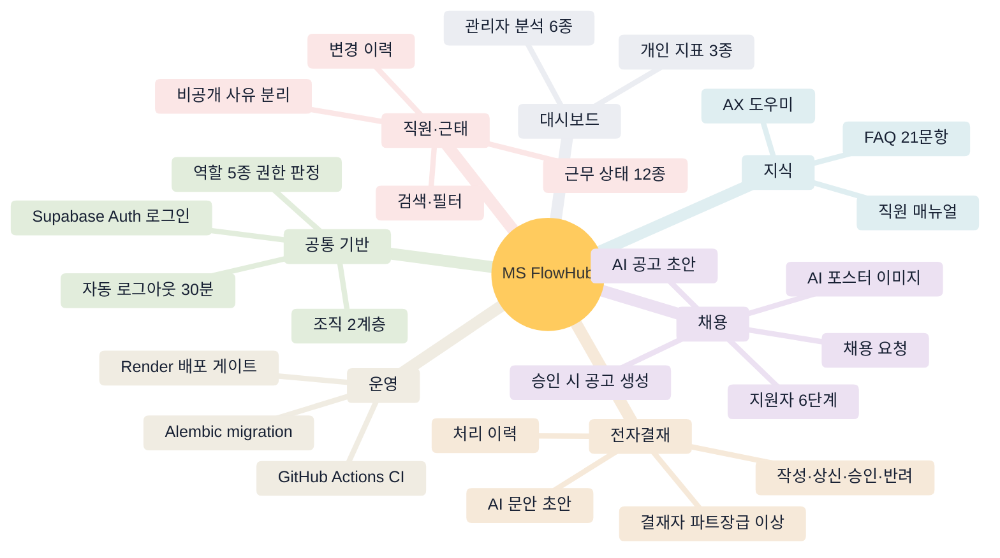
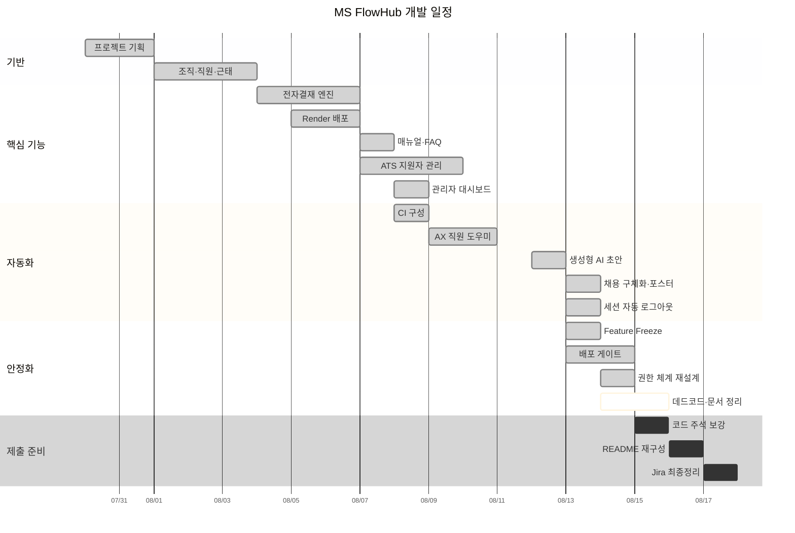

# Roadmap

전체 그림과 앞으로 할 일입니다.

- 각 기능을 **왜 만들었나** → [`PLAN.md`](PLAN.md)
- 지금 **무엇이 되고 안 되나** → [`CURRENT_STATE.md`](CURRENT_STATE.md)
- 날짜별 **변경 이력** → [`../UPDATELOG.md`](../UPDATELOG.md)
- Jira 보드 반영 대상 → [`JIRA_UPDATE_2026-08-08.md`](JIRA_UPDATE_2026-08-08.md)
- 2026-07-30 작성 당시의 일정 기준선 → [`archive/ROADMAP_PLAN_2026-08.md`](archive/ROADMAP_PLAN_2026-08.md)

## 기능 구성 한눈에 보기

## 진행 일정

## 지금 하는 일 — 포트폴리오 제출 준비

목표는 **"어느 파일에 무엇이 왜 있는지 설명할 수 있는 저장소"** 입니다.
용량 감소는 부수 효과이고 설명 가능성이 목적입니다.

| 단계 | 내용 | 상태 |
|---|---|---|
| 1 | 데드코드·중복 자산 정리, 알림 기능 제거 | **완료** |
| 2 | 기획 문서 5개를 `PLAN.md`로 통합, archive 정리 | **완료** |
| 3 | 로드맵 시각화, 문서 안내 신설 | **완료** |
| 4 | 핵심 코드 주석 보강 — 시니어가 주니어에게 설명하는 수준 | 예정 |
| 5 | README 재구성 — 프로젝트 구성 요약 중심 | 예정 |
| 6 | 전체 검증 | 예정 |
| 7 | Jira 최종정리 | 예정 |

## 그다음 — 우선순위 순

| 순서 | 항목 | 비고 |
|---|---|---|
| 1 | **GitHub branch protection** | `master` 직접 push 금지 + PR 필수 CI. Render 게이트가 하류 방어라면 이쪽이 상위 보호 |
| 2 | **Pre-Deploy Command로 migration 자동화 검토** | 현재는 배포 전 수동 `alembic upgrade head`. 실패 시 운영 DB가 중간 상태로 남을 위험이 있어 별도 판단 |
| 3 | **화면이 없는 기능의 UI** | 결재 문서 수정 · 공고 수정 · 역할 변경. API는 준비돼 있고 화면만 없습니다 |
| 4 | 공통 오류 응답 형식 정리 | |
| 5 | ATS·Storage Playwright E2E 확대 | |

## 후속 과제 — 착수 시점 미정

구조에 손대야 해서 별도 판단이 필요합니다.

- **직급과 직책 컬럼 분리** — `employees.position` 한 컬럼에 사원·대리(직급)와 팀장·파트장(직책)이
  섞여 있어 파트장의 직급을 표현할 수 없습니다
- **역할 값 어휘 통합** — `employee_accounts.role`(권한)과 `employees.role`(시드)이 다른 값을 씁니다
- **storage 레이어** — `localStorage`를 감싸는 규칙만 있고 구현이 없습니다
- **조직도 API 활용** — `GET /employees/organization`이 있는데 화면은 1.24MB 정적 PNG를 씁니다

## 확정된 정책

되돌리지 않기로 한 결정입니다. 근거는 [`DECISIONS.md`](DECISIONS.md).

- **대시보드에 가짜 업무 데이터를 넣지 않습니다.** 지표가 비어 보여도 실데이터만 씁니다.
- **AI는 업무 상태를 바꾸지 않습니다.** 초안을 만들 뿐 저장은 사용자가 합니다.
- **Playwright E2E는 수동 실행 전용입니다.** 실제 Supabase에 접속하므로 CI에서 자동 실행하지 않습니다.

## 범위 밖

의도적으로 만들지 않기로 한 것들입니다. 배경은
[`PLAN.md`](PLAN.md#1-프로젝트-배경과-범위--2026-07-30).

실제 이메일 발송 · PDF 분석·OCR · RAG·벡터 DB · n8n · 다단계 결재 ·
WebSocket 실시간 알림 · Docker · 모바일 앱 · 자동 채용 결정

인앱 알림은 2026-08-14에 제거했습니다. 사내 메일 시스템 도입 시 다시 설계합니다.
